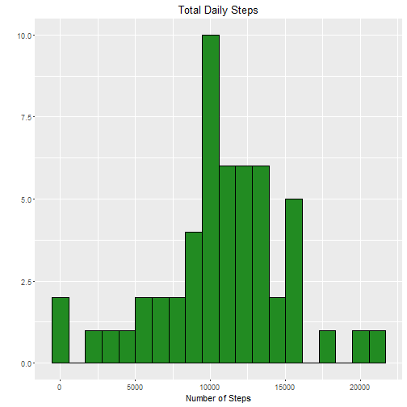
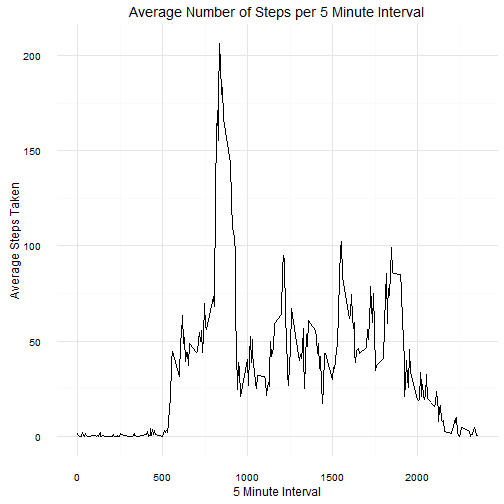
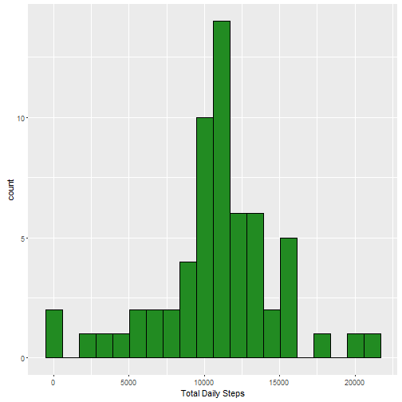
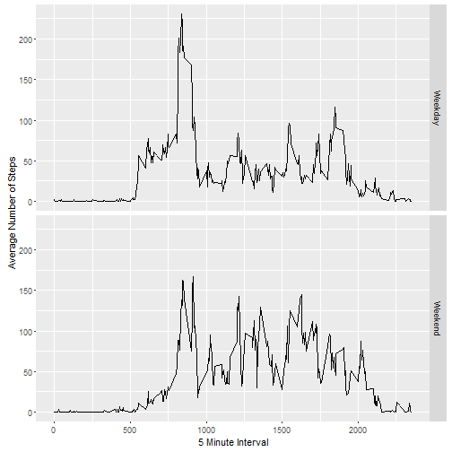

## Loading and preprocessing the data

Displayed below is code used to download this data.  Note:  I specify the directory where my dataset is drawn from.  To compile this 
document on another computer, this would have to be changed.  However, as long as the correct directory is selected in regards to activity.csv, this code will execute correctly.


```r
library(plyr)
library(dplyr)
```

```
## 
## Attaching package: 'dplyr'
```

```
## The following objects are masked from 'package:plyr':
## 
##     arrange, count, desc, failwith, id, mutate, rename, summarise,
##     summarize
```

```
## The following objects are masked from 'package:stats':
## 
##     filter, lag
```

```
## The following objects are masked from 'package:base':
## 
##     intersect, setdiff, setequal, union
```

```r
library(tidyr)
library(ggplot2)
setwd("C:/Users/Peter Caya/Documents/R/Coursera/Reproducible_Research/Week 2/Project 2")
data <- read.csv("activity.csv")
data$date <- as.Date(data$date)
```

## What is the mean total number of steps taken per day?


### Calculate the total number of steps per day

Displayed below is the code used to calculate the total number of steps per day as well as a histogram showing the daily activity pattern across the different time intervals.  


```r
datavals <- data[!is.na(data$steps),]
datavals$date <- as.Date(datavals$date)

daterange <- as.Date(unique(datavals$date))

step_sum <- group_by(datavals, date) %>% summarize(total_steps = sum(steps), mean_steps = mean(steps), median_steps = median(steps))

step_mean <-  group_by(datavals, date) %>% summarize(total_steps = mean(steps))
step_median <-  group_by(datavals, date) %>% summarize(total_steps = median(steps))

hist_plot <- ggplot(step_sum,aes(x = total_steps))+geom_histogram(fill="forestgreen",col="black",bins = 20)
hist_plot<- hist_plot+ggtitle("Total Daily Steps") + xlab("Number of Steps") + ylab("")
hist_plot
```



```r
meansteps <- mean(step_sum$total_steps)

mediansteps <- median(step_sum$total_steps)
```
There is a mean of 1.0766189 &times; 10<sup>4</sup> and a median of 10765 steps per day.


### What is the average daily activity pattern?


Now, plot the average number of steps taken at each five minute interval on average:


```r
activity_level <- datavals %>% group_by(interval) %>% summarise(step_interval = mean(steps))
step_line <- ggplot(activity_level, aes(x = interval, y = step_interval)) + geom_line() 
step_line <- step_line + ggtitle("Average Number of Steps per 5 Minute Interval") + xlab("5 Minute Interval") + ylab("Average Steps Taken") + theme_minimal()
step_line 
```




The 5 minute interval that has the highest number of expected steps is 835 which has an average of  206.1698113 steps. 

### Inputing missing values

The way I did this is more messy than I'd like.  If the grader as the time, I'd really appreciate some suggestions.  The aim is to take an index of the missing values using the which function, run a loop to create a vector containing the average number of steps relevant to the time interval for each of these missing values, and then to use the index first described in order to replace the missing values.  


```r
data_na_rm <-data 
na_count <- sum(is.na(data$steps))

# Return the time interval for each of the NA values.  Then, look up its mean in the activity level data frame from earlier.
# na_steps gives the interval relevant to the NA values that were returned.  These values will then be looked up in the 
# activity level frame in order to get the average.

na_index<- is.na(data$step)
na_steps  <- data[na_index,3]
na_replace <- rep(0,length(na_steps))
# Generate a vector of replacement values for the unavailable values based off of the day's interval.  I used the which() function to get the indexes
# for the missing values and then replaced them with the corresponding replacement values which are found in the for-loop.  This is a grotesque way
# of doing this though so I am up for suggestions!

for(i in 1:length(na_steps)){
na_replace[i] <-as.numeric(activity_level[activity_level$interval==na_steps[i],2])
}
data_na_rm$steps[which(na_index)] = na_replace
```

We see that after the above steps we go from a total number of 2304 missing data points for steps to a total of 0:

```r
head(data_na_rm,10)
```

```
##        steps       date interval
## 1  1.7169811 2012-10-01        0
## 2  0.3396226 2012-10-01        5
## 3  0.1320755 2012-10-01       10
## 4  0.1509434 2012-10-01       15
## 5  0.0754717 2012-10-01       20
## 6  2.0943396 2012-10-01       25
## 7  0.5283019 2012-10-01       30
## 8  0.8679245 2012-10-01       35
## 9  0.0000000 2012-10-01       40
## 10 1.4716981 2012-10-01       45
```

```r
step_sum_narm <- group_by(data_na_rm, date) %>% summarize(total_steps = sum(steps), mean_steps = mean(steps), median_steps = median(steps))
```
The result of imputing the missing values that I used  is that while the mean of the steps stays the same ( 1.0766189 &times; 10<sup>4</sup> to 1.0766189 &times; 10<sup>4</sup>),  the median changes from 10765 to 1.0766189 &times; 10<sup>4</sup>. Because I am replacing unavailable data with the average for the time interval it stands to reason that the change in the average for the number of steps per day will stay roughly the same.  However, adding more observations of the expected values will change the median for the daily number of steps.

Here is the histogram showing the distribution of the total number of daily steps after imputing the missing data.  Replacing the unavailable values increases the number of observations that we have when we produce the histogram but does not change the distribution of the data.

```r
g_hist_narm <- ggplot(data = step_sum_narm, aes(total_steps)) + geom_histogram(fill="forestgreen",col="black",bins = 20)+ xlab("Total Daily Steps")
g_hist_narm
```




## Are there differences in activity patterns between weekdays and weekends?

First, take the original data set and specify the day of the week being considered.  Afterwards, make a panel plot of the average number of steps taken in five-minute intervals averaged across all weekdays and weekend-days.  


```r
data_na_rm$weekdays<-weekdays(data_na_rm$date  )
data_na_rm$DotW <- grepl("Saturday|Sunday",x = data_na_rm$weekdays )

weekend_frame <- data_na_rm %>% filter(DotW ==TRUE)
weekday_frame <- data_na_rm %>% filter(DotW ==FALSE)

mean_summary_weekday <- weekday_frame %>% group_by(interval) %>% summarise(meansteps  = mean(steps))
mean_summary_weekday$day_type <- "Weekday"
mean_summary_weekend <- weekend_frame %>% group_by(interval) %>% summarise(meansteps  = mean(steps))
mean_summary_weekend$day_type <- "Weekend"
mean_summary <- rbind(mean_summary_weekend,mean_summary_weekday)

g_panels <- ggplot(data = mean_summary, aes(x= interval,y= meansteps)) + geom_line()+facet_grid(day_type~.)
g_panels <- g_panels + labs("Average Daily Steps Segmented Based on Day-Type",x = "5 Minute Interval", y = "Average Number of Steps")
g_panels
```




